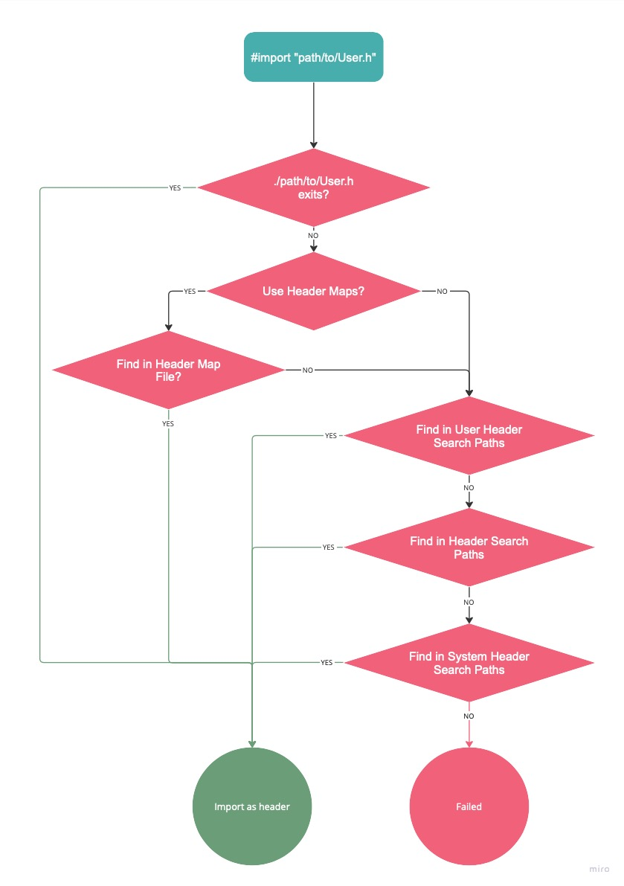
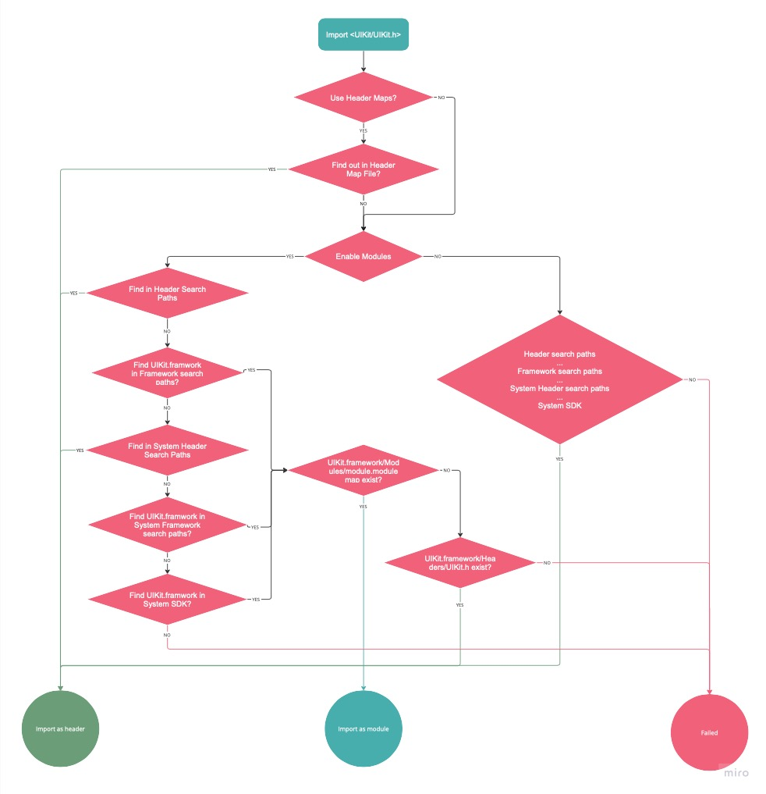
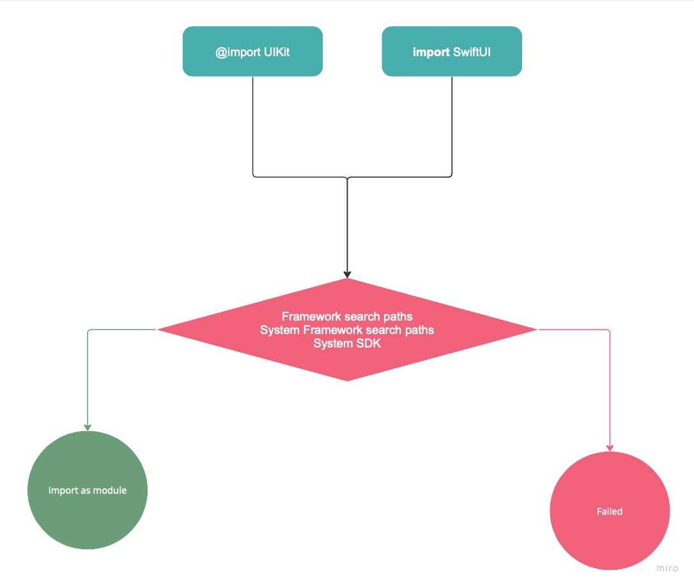
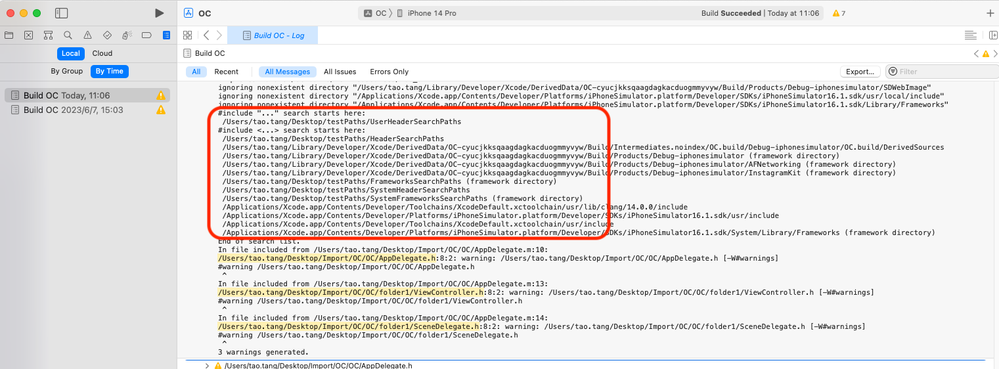

# iOS 开发中的 import 机制

关于 import 机制，iOS 社区已经有诸多文章对其进行剖析，如 [从预编译的角度理解Swift与Objective-C及混编机制](https://tech.meituan.com/2021/02/25/swift-objective-c.html) 介绍的很全面。本文也并非从0开始讨论 import 机制，而是以笔者个人视角，尝试回答一些之前令笔者迷惑的问题。

## 什么是ClangModule?
在 [从预编译的角度理解Swift与Objective-C及混编机制](https://tech.meituan.com/2021/02/25/swift-objective-c.html) 一文开始，作者详细阐述了 #import 的文本复制机制和 PCH 的局限性。因此在PCH的基础之上，[Clang Modules](https://clang.llvm.org/docs/Modules.html) 的概念被提出，本质也是对头文件的预编译。  
具体的表现是，对于支持 Clang Modules 的库，其 framework 在原先文件结构的基础之上增加了 **Modules/module.modulemap** 文件。以 UIKit.framework 为例, 其文件结构为: 

```swift
└── UIKit.framework
    └── Headers
        ├── ...
        ├── UIKit.h
        └── ...
    └── Modules
        └── module.modulemap
    └── UIKit.tbd
```

如果某个源文件以 Modules 的方式导入 UIKit, 编译器则会根据 module.modulemap 中描述的规则对 Headers 目录中的头文件进行预编译，并将其缓存在 **/DerivedData/ModuleCache.noindex** 目录中，其他源文件的编译过程则可以复用这一结果。

### 如何 import 一个支持 Modules 的库？

### 直接引入
使用 @import xxxx.xxxx, 编译器则直接使用 Modules 的方式。

### 间接引入
使用 #import<xxx/xxx.h>, 同时开启 Build Settings > Apple Clang - Language - Modules > Enable Modules (C and Objective-C), 则 Xcode 会优先使用 Modules 的方式引入。其优势是在 module.modulemap 不存在的情况下自动切换到头文件引入。

需要特别提到的是 Enable Modules (C and Objective-C) ，关于这个配置 Apple 给出的解释是

> Enables the use of modules for system APIs. 
> System headers are imported as semantic modules instead of raw headers. 
> This can result in faster builds and project indexing.

这里的 `system APIs`  并非意味着只有 Apple 官方提供的库才能生效，而是所有以尖括号<>  (即 #import <xxxx/xxxx.h>) 方式引入库都会尝试使用 ClangModule 方式导入，如果该库不支持 ClangModule，则以头文件复制方式引入。

## 如何支持 Clang Modules？
要让一个库支持 Clang Modules, 只需要将 Build Settings > Packaging > Defines Module 设置为 YES, Xcode 会根据 Build Phases > Headers 中的配置自动生成 module.modulemap 文件。 开发者同时可以通过 Build Settings > Packaging > Module Map File 使用自定义 modulemap 文件。

## 头文件引入的优化方案 hmap
回到原始的头文件复制上来，即便项目不使用 Modules，Apple 依然为之前的方式提供了优化方案，即 Build Settings > Search Paths > Use Header Maps 选项。

其本质是在原文件编译之前，由 Xcode 构建 **文件 > 文件路径** 的映射，即 .hmap 文件，在编译阶段传递给编 Clang。Clang 在查找某个头文件的时候会优先使用该文件，通过一次哈希查询即可知道文件的路径，无需通过遍历文件夹查找。需要补充的是，该配置并非用于 开启/禁用 Hmap 的功能(编译器的 hmap 能力是一直生效的)，而是告知 Xcode 是否自动生成 .hmap 文件。如果将其配置为 NO，开发者依然可以在 Header Search Paths 中配置自定义 .hmap 。

## 什么是Swift Modules?
和 ClangModule 思路相同，只是 Swift 没有头文件，取而代之的是对 .swiftinterface 进行预编译。SwiftUI.framework 的结构如下：
 
```swift
└── SwiftUI.framework
    └── Headers
        └── SwiftUI.h
    └── Modules
        └── SwiftUI.swiftmodule
            ├── arm64-apple-ios-simulator.swiftinterface
            └── x86_64-apple-ios-simulator.swiftinterface
        └── module.modulemap
    └── SwiftUI.tbd
```

Swift 编译器同样会对导入的 Module 进行预编译，并将其缓存在 `/DerivedData/ModuleCache.noindex` 目录中，不过是基于 .swiftinterface 的内容。

那这里的 module.modulemap 和 SwiftUI.h 有什么用呢？ 答案其实很明显，支持 ClangModule。  
其实 SwifUI.h 中只有一行代码: #import <UIKit/UIKit.h>。也就是说虽然 SwiftUI 的声明式 UI 不支持 OC， 但是在 OC 代码中依然可以使用 #import<SwiftUI/SwifUI.h> 并且编译通过, 其本质是导入了 UIKit。

SwiftUI.framework 同时也展示了如何让一个 framework **同时支持** OC 和 Swift：

- 有 Headers 就能以头文件的方式被引入
    - 以 Headers 为基础，构建 Module/module.modulemap 就能以 Clang Modules 的方式被引入
- 有 Module/SwiftUI.swiftmodule 就能被 Swift 代码引入


## #import 是如何按照什么顺序查找的？
那么，要成功引入一个库，自然前提是正确查找这个库的位置。XCode Build Settings 中影响 import 的配置繁多。它们之间的关系如下：


<kbd>
  
</kbd>
<kbd>
  
</kbd>
<kbd>
  
</kbd>


以上是基于 XCode 14.1 的测试结果，同时它们依然不是 import 查询路径的全貌，通过为 `Build Settings > Apple Clang - Custom Compiler Flags` 添加 -v 参数，可以查看详细的编译器输出:

<kbd>
  
</kbd>

同时编译器也会输出每一个文件 .m 或者 .swift 的依赖解析的结果，并存放在 Build 目录的 .d 文件中：例如 /Build/Intermediates.noindex/OC.build/Debug-iphonesimulator/OC.build/Objects-normal/x86_64/AppDelegate.d :

```
dependencies: /Users/tao.tang/Desktop/Import/OC/OC/AppDelegate.m \
  /Users/tao.tang/Desktop/Import/OC/OC/AppDelegate.h \
  /Users/tao.tang/Desktop/testPaths/FrameworksSearchPaths/UIKit.framework/Modules/module.modulemap \
  /Users/tao.tang/Desktop/Import/OC/OC/folder1/ViewController.h \
  /Users/tao.tang/Desktop/Import/OC/OC/folder1/SceneDelegate.h
```


## Swift 和 OC 的跨 Module 互操作

**Swiftc 内置了大部分 Clang 的能力**, 因此可以直接处理 Clang Modules，对于 OC 实现的 framework 来说，只需要支持 Clang Modules，即可被 Swift 正确 import，例如 UIKit。

而 Swift 想要暴露接口给 OC 使用需要生成对应的头文件，或者更进一步支持 Clang Modules，例如上面的 SwiftUI。针对这两个需求，Xcode 也提供了相应的支持，在：

- Build Settings > Swift Compiler - General > Install Objective-C Compatibility Header
- Build Settings > Packaging > Defines Module


