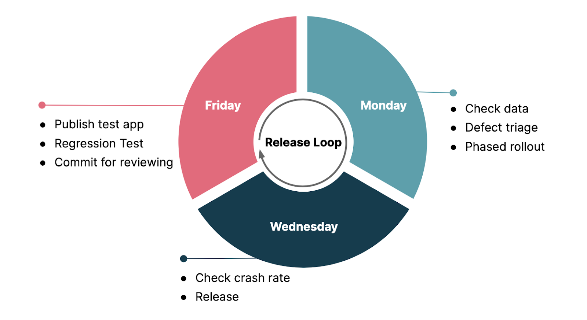
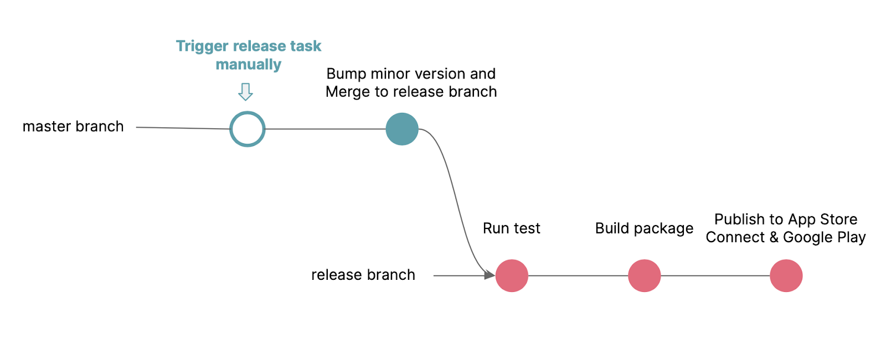

# 如何实现 mobile app 每周发版

## 移动端面临的挑战

在软件行业多年的实践过程中，发布策略在不断演化和完善。对于后端和 Web 端项目，版本的发布可以做到快速高频，将每一次发布内容控制在尽量小的范围，进行快速迭代，出错的概率和修复问题的难度也会随之降低，有助于提高整个系统的稳定性。

相较而言，移动端往往面临更多的挑战。  
首先，移动端项目面临审核周期，无法在发布后立即触达用户。审核周期受发布平台限制(App Store/Google Play), 一般是在 1~3 天.
其次，用户的升级意愿不可控，强制升级等策略严重影响用户体验，导致新版本一般无法覆盖旧版本。

## 移动端的快速发布实践

APP 已经演进多年，由于当前项目团队规模大(100 人+)，有多个 feature 团队并行开发业务，功能迭代较快，且相对独立，发布计划难以统一。综合业务和团队需求，我们制定了每周发布一个 新版本的策略，以此来保证各团队都能及时发布。如果某团队意外错过了当周的发布，也能保证发布间隔控制在两周内，满足我们对 APP 小步高频迭代的要求。

### 每周发布策略

结合 APP 审核周期和用户日活跃情况，我们制定了从本周五到下周三的 release loop 策略, 并由各团队成员每周轮值发布 iOS 和 Android 双端。

#### 周五

周五是 release loop 的起点，我们在周五主要完成对新版本 App 回归测试和提交审核，为下周一的顺利发布做好准备。因此，需要完成以下工作：

- 各 feature 团队需在周五之前将待发布的代码合并 master 分支
- 由本周轮值的发布者在 pipeline 开启打包任务及发布测试版 (TestFlight & Google Play), 该测试版将被各 feature 团队用于回归测试
- 各 feature 团队回归测试各自的业务功能，并由本次轮值的发布者收集反馈和问题
- 提交审核，并选择手动发布模式

#### 周一

审核周期一般为 1~2 天, 正常情况下，周一就能通过审核。此时新版本 App 处于可发布状态。在发布之前，我们将从数据和功能两个方面对新版本 App 进行评估，判断其是否可以发布给用户。

- 由本次轮值的发布者验证后端收集的埋点数据是否符合预期，是否包含最新版本的相关数据。业务侧会根据核心业务，制定验证指标，checklist 等， 并随着版本持续更新。
- 根据本次轮值的发布者在上周五收集到的反馈（回归测试的问题/bug），由 PO 评估确定是否继续本次发布
  如果无重大问题，开始灰度发布给部分用户。App Store 和 Google Play 分别都提供了 Rollout 的特性。
  - 在 App Store Connect 开启自动更新的 7 天灰度发布，该发布策略无法由开发者定制, App Store 将从周一开始分阶段发布，并按照周一 1%，周二 2%，周三 5% 的进度发布给开启自动更新功能的用户
  - 在 Google Play 灰度发布给 5% 的用户
- 如果新版本无法通过以上评估，发布者将暂停本次发布，并联系导致问题的团队进行修复。然后由发布者构建新的 fix 版本，并再次提交审核，审核通过后继续灰度发布。

### 周三

根据团队与业务达成的共识，可接受的新版本 crash 率不能超过 0.25% ， 由本次轮值的发布者确认低于这个阈值后，发布给所有用户:

- iOS 从 5% 更新到 100%
- Android 从 5% 更新到 100%
  同时在新版本全量上线后，crash 率监测系统将持续监测 crash 率的变化，并在 crash 率超 0.25% 时向开发团队提出预警。此时，我们将及时解决问题并提审新的 hotfix 版本，通过后直接发布给所有用户。

至此一个完整的发布循环结束，整个策略中的三个关键点：

- 选择周五发布测试版和提交审核，利用周末为测试和审核预留时间
- 明确发布 checklist 和验收指标，减少沟通成本
- 使用各平台的 phased rollout 机制进行发布，控制风险

### 发布背后：效能和质量把控

#### 自动化

为了提升发布效率，避免频繁的发布任务成为某个团队的负担，我们对发布流程做了高度自动化，让每个团队成员都具备发布的能力。每周轮值一位团队成员负责 iOS/Android 双端的发布。
我们采用 master 分支开发、release 分支发布的方式，发布者能够在 pipeline 一键开启发布，将新版本上传到 App Store Connect 和 Google Play。

#### 质量保证

在开发过程中保证代码质量，同时在发布之前增加多重测试来保证版本质量，提升发布的信心。

- 开发过程中，引入单元测试、UI 测试、e2e 测试等保证测试覆盖。
- 在 Pipeline 上自动集成各项测试，并将测试覆盖率 可视化。
- 每一个新增的功能发布前，团队内部会做一次 bugbash。
- 在发布之前各 Feature 团队根据各自业务 checklist 完成对应的回归测试。

#### 回滚控制

团队采用 truck-based 的开发模式，通过 Feature toggle 来控制新功能的开发，同时保证了发布的灵活性和风险控制。

- 正在开发中但尚未完成的功能，通过开关控制，可以随 App 一起发布，不阻碍当次发布的流程。
- 新功能上线前期，会保留开关直至功能稳定使用，使 App 具备在发生重大问题时的紧急回退能力

## 总结

APP 的发版策略总体上需要综合业务、市场、用户的实际需求以及开发团队的实际情况来做综合权衡。这种固定每周发布的实践并不一定适合所有的 mobile app，但基于我们的实践经验，如果想要实现安全高效快速的发布，需要做到一下四个关键点：

- 做好发布的高度自动化，减少手动发布出错的可能性；同时也提升发布效率，不让团队被发布任务拖累
- 保证足够多环节的测试覆盖(自动+手动测试)，提升版本质量和频繁发版的信心
- 业务需要制定核心业务的验证指标，同时 App 需具备相对完善的数据埋点能力，合力支撑起新版本核心数据的验证，便于做 APP 是否真正发布给最终用户的决策。
- APP 要具备灵活的回滚能力，做好风险应对。
