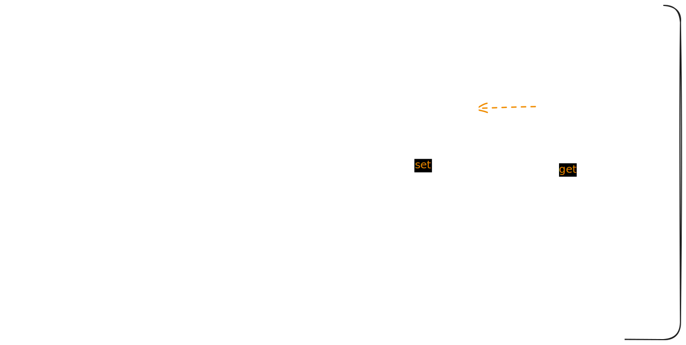

# 一种在 NavigationStack 进行依赖注入的架构设计

## 痛点
试想以下场景,在 NavigationStack 中依次打开了 [A -> B -> C -> D] 四个页面,D 作为整个功能的结算页需要整合前面所有页面的信息。那么如何将 A,B,C 三个页面的信息传递到 D 页？
目前我已知解决方案有: 
    
1. 定义一个共享对象,其可以被所有页面访问,用于接收和传递参数。
2. 在 B,C,D 三个页面的构造器中定义参数接收前面页面传递的值。

这两种方案都有其明显的缺点,这里不做讨论。这个场景最核心的问题在于 **SwiftUI 虽然提供了 NavigationStack,但并没有提供 Stack 层面的依赖注入机制** 。

## 如何实现

如上图所示,核心设计为： 

1. 为每一个页面关联一个对象,用于存储该页面设置的数据。该对象将被作为 SwiftUI Environment 注入各自的页面,用于 set/get 值。 
2. 这些对象将被按顺序构建为一个链表,**利用 SwiftUI Preference 的`reduce` 方法,该方法的调用会严格遵循视图树的顺序,因此可用于构建可靠的链接关系**。 
3. 当某个页面需要取值时,从从前页面的对象开始沿着链表往前查询,直到从某一个对象查询到结果为止。 

利用以上的设计,就可以实现 **沿 NavigationStack 向后注入任意值**。

> 本文只涉及整体的架构思路,并不包含实现细节,详情可查看 https://github.com/TStrawberry/NavigationValues

---

# An Architecture Design for Dependency Injection on NavigationStack

## Pain Points

Imagine a scenario where four pages [A -> B -> C -> D] are opened sequentially in a NavigationStack. Page D acts as the settlement page of the whole feature and needs to integrate information from all previous pages. So how do we pass the information from pages A, B, and C to D?

Currently known solutions include:
1. Defining a shared object accessible by all pages, used to receive and pass parameters.
2. Defining parameters in the constructors of pages B, C, and D to receive values passed from previous pages.

Both approaches have their obvious drawbacks, which will not be discussed here. The core problem with this scenario is that **although SwiftUI provides NavigationStack, it does not offer a stack-level dependency injection mechanism**.

## How to Implement

As shown in the diagram above, the core design includes:
1. Associating each page with an object to store data set on that page. This object is injected into its corresponding page via the SwiftUI Environment, used to set/get values.
2. These objects are constructed as a linked list in order. **By utilizing the `reduce` method of SwiftUI Preference, whose calls strictly follow the view tree order, reliable links can be established.**
3. When a page needs to fetch a value, it starts querying backwards along the linked list, beginning from the previous page's object, until a result is found.

With this design, **arbitrary values can be injected backwards along the NavigationStack**.

> This article only covers the overall architectural idea and does not include implementation details. For more information, see https://github.com/TStrawberry/NavigationValues

